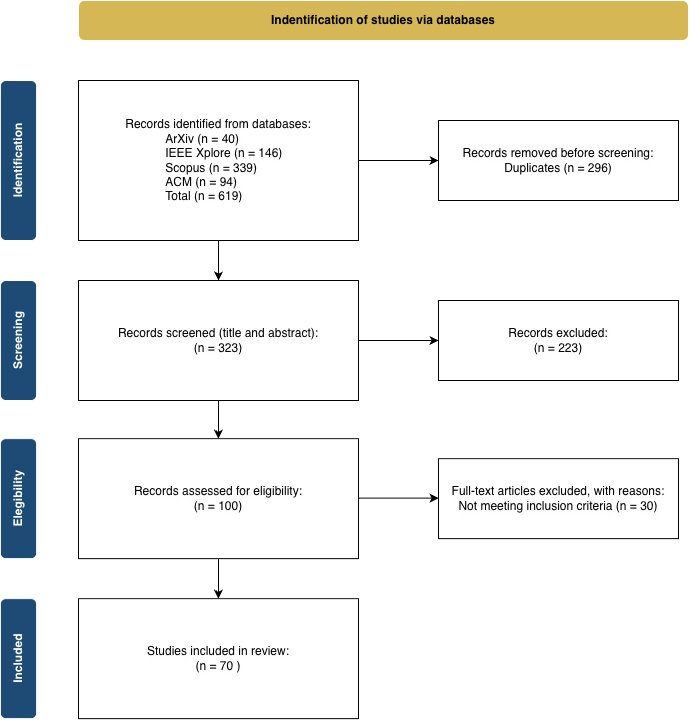

<p align="center">
  
</p>

<h1 align="center">AMIML</h1>
<h3 align="center">Post-Hoc Model-Agnostic Interpretability Methods:<br>A Systematic Review and Unified Framework</h3>

<p align="center">
  <a href="https://mysticdeepai.github.io/AGNOSTIC-METHODS-FOR-INTERPRETABILITY-IN-MACHINE-LEARNING-a-systematic-review/"></a>&nbsp;
  <a href="data/DB.xlsx"></a>&nbsp;
  <a href="https://docs.google.com/spreadsheets/d/1eGMfH1z3LzcSONOjE0mZN7OrxXNLxSGFipiKlODofR0/edit?usp=sharing"></a>
</p>

<p align="center">
  
  
  
  
  
</p>

---

## Overview

This repository contains the **data, code, and interactive companion website** for a systematic literature review of **Model-Agnostic Interpretability Methods (MAIMs)** — post-hoc techniques that explain any black-box predictor solely through input–output queries.

The paper makes three contributions:

| # | Contribution | Section |
|---|---|---|
| **1** | **Unified Conceptual Pipeline** — Deconstructs MAIMs into Context (κ), Sampling, Surrogate (G), and Regularization (Ω), revealing how shifting between marginal, conditional, and interventional semantics induces distinct bias profiles | §3 |
| **2** | **PRISMA 2020-Compliant SLR** — Descriptive evidence map of *n* = 70 method papers (2020–2025) across 8 research questions, complemented by 44 application-focused studies | §4 |
| **3** | **ISO/IEC TS 6254:2025-Aligned Evaluation Methodology** — Artifact-conditioned metric selection, falsifiability testing, and standardized reporting for MAIM evaluation | §5 |

## Key Findings

| Dimension | Finding |
|---|---|
| **Scope** | Local explainers dominate (53/70); global-only methods are scarce (11/70) |
| **Outputs** | Attribution outputs overrepresented (43/70); effect-summary severely underrepresented (4/70) |
| **Data** | Tabular benchmarks dominate (48/70); graph (2) and audio (1) virtually absent |
| **Evaluation** | Fidelity — the top metric — appears in only 20% of studies; no minimum protocol exists |
| **Human feedback** | Only 10% of studies incorporate any form of human evaluation |
| **Normative** | Privacy (7) and regulation (6) lead; fairness (2) and security (0) are nearly absent |
| **Practice gap** | Despite causal variant availability (MINT, CALIME, CDPs), practitioners default to correlational SHAP/LIME |

## Repository Structure

```
.
├── README.md                          # This file
├── LICENSE                            # MIT License
├── CITATION.cff                       # Citation metadata
├── pyproject.toml                     # Package build configuration
├── .gitignore
│
├── src/amiml/                         # Modular analysis package
│   ├── __init__.py                    #   Public API & version
│   ├── loader.py                      #   Data loading, cleaning, multi-label expansion
│   ├── taxonomy.py                    #   Rule-based family mappers (scope, data, task, output)
│   ├── metrics.py                     #   Quantitative/qualitative metric normalisation
│   ├── themes.py                      #   Keyword dictionaries for thematic coding
│   ├── analysis.py                    #   Section-level synthesis (§4.2–§4.8) & run_all()
│   ├── plots.py                       #   Publication-quality matplotlib figures
│   ├── export.py                      #   BibTeX export helpers
│   └── arxiv.py                       #   arXiv API search & RIS export
│
├── data/
│   └── DB.xlsx                        # Extraction database (3 sheets)
│       ├── DATA_EXTRACTION            #   70 included studies × 29 variables
│       ├── DOMAIN                     #   Application-domain mapping
│       └── Others                     #   Supplementary records
│
├── notebooks/
│   ├── Data_analysis.ipynb            # Synthesis notebook (imports from amiml)
│   └── ARXIV_WEB_SCRAPING.ipynb       # arXiv search automation
│
├── ris/                               # PRISMA bibliographic records (RIS format)
│   ├── identification/
│   │   └── 619.ris                    # All identified records (n = 619)
│   ├── duplicates/
│   │   ├── 296_1.ris                  # Duplicate batch 1 (n = 141)
│   │   └── 296_2.ris                  # Duplicate batch 2 (n = 155)
│   ├── screening/
│   │   └── 364.ris                    # Excluded at screening (n = 364)
│   ├── eligibility/
│   │   └── 30.ris                     # Excluded at full-text (n = 30)
│   └── included/
│       └── 70.ris                     # Final included corpus (n = 70)
│
├── figures/
│   └── prisma_flow.png                # PRISMA 2020 flow diagram
│
└── docs/                              # GitHub Pages website
    ├── index.html                     # Interactive companion site
    └── data/
        └── prisma_flow.png
```

## PRISMA 2020 Flow

| Stage | Records | Action |
|:---|---:|:---|
| **Identification** | 619 | arXiv (40) · ACM DL (94) · IEEE Xplore (146) · Scopus (339) |
| Duplicates removed | −296 | Rayyan deduplication + manual inspection |
| **Screening** | 323 | Title & abstract screening |
| Excluded (screening) | −223 | Out of scope |
| **Eligibility** | 100 | Full-text assessment |
| Excluded (full-text) | −30 | Not meeting inclusion criteria |
| **Included** | **70** | Final corpus for synthesis |

## Data Extraction Variables

The extraction database (`data/DB.xlsx`, sheet `DATA_EXTRACTION`) records the following variables for each included study:

| Variable | Description |
|---|---|
| Title, Authors, Abstract, Keywords | Bibliographic metadata |
| Citation count (Google Scholar) | Visibility proxy |
| Publication year, Link | Temporal and access metadata |
| Method Name, Repository | Method identifier and reproducibility |
| Type (Local/Global) | Explanation scope |
| Theoretical Foundation, Algorithm | Underlying principles |
| Output Type | Explanation artifact form |
| Data Type, Datasets | Input modalities and benchmarks |
| Domain Application, Task Type | Deployment context |
| Quantitative / Qualitative Metrics | Evaluation criteria |
| Human Feedback | User/expert validation |
| Key Findings, Limitations/Challenges | Reported contributions and issues |
| Ethical/Regulatory Aspects | Normative considerations |

## Interactive Companion Website

The companion website provides:

- **Overview** — Paper abstract, key findings, research questions
- **MAIMs Framework** — Formal definitions, conceptual pipeline, bias profiles, variant taxonomy
- **SLR & PRISMA** — Search strategy, eligibility criteria, interactive flow diagram, records browser (all 619 records navigable by PRISMA stage)
- **Evaluation & ISO** — Three-phase methodology (Selection → Evaluation → Sanity Checks)
- **Domain Applications** — Cybersecurity, Finance, Healthcare, Industrial Systems
- **Regulatory Landscape** — GDPR, EU AI Act, ISO/IEC TS 6254:2025, NIST, Latin American frameworks
- **Corpus** — Full extraction table with column toggles, search, and domain mapping

**🔗 [Access the companion website →](https://mysticdeepai.github.io/AMIML-SLR/)**

## Reproducing the Analysis

```bash
# 1. Clone the repository
git clone https://github.com/MysticDeepAI/AGNOSTIC-METHODS-FOR-INTERPRETABILITY-IN-MACHINE-LEARNING-a-systematic-review.git
cd AGNOSTIC-METHODS-FOR-INTERPRETABILITY-IN-MACHINE-LEARNING-a-systematic-review

# 2. Install the amiml package (editable mode + dev dependencies)
pip install -e ".[dev]"

# 3. Run the analysis notebook
jupyter notebook notebooks/Data_analysis.ipynb
```

Or use the package directly from Python:

```python
from amiml.analysis import run_all
from amiml import plots

results = run_all("data/DB.xlsx")

# Example: plot papers per year (§4.2)
plots.plot_year_counts(results["4.2"]["year_counts"], outpath="figures/year_counts.png")

# Example: view ethical themes (§4.7)
print(results["4.7"])
```

## Google Sheets (Live Version)

For the most up-to-date extraction data, access the live Google Sheet:

📋 **[Open Google Sheet →](https://docs.google.com/spreadsheets/d/1eGMfH1z3LzcSONOjE0mZN7OrxXNLxSGFipiKlODofR0/edit?usp=sharing)**

## Citation

If you use this repository, data, or methodology in your research, please cite:

```bibtex
@article{amiml2025,
  title   = {Post-Hoc Model-Agnostic Interpretability Methods: A Systematic
             Review and Unified Framework for Technical Evolution, Bias
             Diagnosis, and Regulatory Alignment},
  author  = {[Authors]},
  year    = {2025},
  journal = {[Journal]},
  note    = {Under review}
}
```

## License

This project is licensed under the MIT License — see the [LICENSE](LICENSE) file for details.

---

<p align="center">
  <sub>Maintained by <a href="https://github.com/MysticDeepAI">MysticDeepAI</a></sub>
</p>
